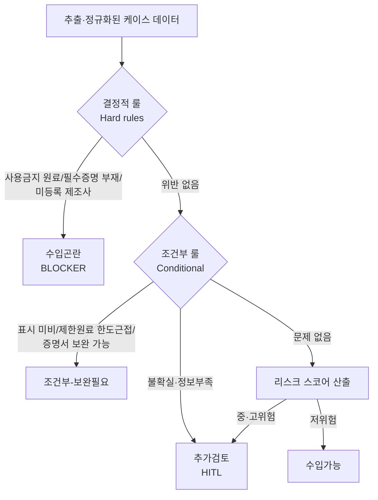
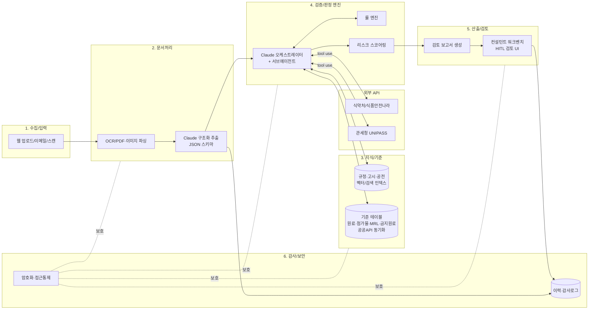

# 수입가능여부 검토 AI 컨설팅 시스템 — 종합 기획·아키텍처 설계서

> **대상**: 천일국제물류(주) 수입 컨설팅 부서 내부 업무 도구
> **목적**: 고객사가 제출한 성분표·제조공정도·현품(라벨)·각종 증명서·선적서류를 **Claude(LLM) 기반으로 자동 검증**하고, 한국으로의 **수입가능여부를 사전 판정**하여 컨설팅 직원의 업무 효율과 정확도를 높인다.
> **작성일**: 2026-06-13 · **버전**: v1.0(초안)
> **분류**: 식품(가공식품·식품첨가물·기구/용기·포장)·건강기능식품·축산물·화장품 수입

---

## 목차

1. [문서 개요](#1-문서-개요)
2. [비즈니스 배경 및 목표](#2-비즈니스-배경-및-목표)
3. [규제 프레임워크 — 무엇을 근거로 판단하는가](#3-규제-프레임워크--무엇을-근거로-판단하는가)
4. [수입가능여부 검토 업무 프로세스](#4-수입가능여부-검토-업무-프로세스)
5. [제출 서류별 검증 체크리스트(핵심 실무)](#5-제출-서류별-검증-체크리스트핵심-실무)
6. [수입가능여부 판정 로직(룰 + 리스크 스코어링)](#6-수입가능여부-판정-로직룰--리스크-스코어링)
7. [공공데이터·외부 API 연동 카탈로그](#7-공공데이터외부-api-연동-카탈로그)
8. [시스템 아키텍처](#8-시스템-아키텍처)
9. [Claude(LLM) 활용 설계](#9-claudellm-활용-설계)
10. [데이터·보안·컴플라이언스](#10-데이터보안컴플라이언스)
11. [단계별 구현 로드맵](#11-단계별-구현-로드맵)
12. [업무 효율·ROI 지표](#12-업무-효율roi-지표)
13. [리스크·한계·거버넌스](#13-리스크한계거버넌스)
14. [부록](#14-부록)

---

## 1. 문서 개요

### 1.1 한눈에 보기

천일국제물류는 평택항 인근 보세창고를 기반으로 **코스트코 등 대형 유통사 납품 물류·통관·검역**을 원스톱으로 수행한다. 이 과정에서 고객사(해외 제조사/수출자)로부터 다음 자료를 받아 **한국 수입 가능 여부**를 사전 검토하는 컨설팅 업무가 핵심이다.

| 받는 자료 | 영문 | 검증의 핵심 질문 |
|---|---|---|
| 성분표/배합비율 | Ingredient list / Composition | 사용 금지·제한 원료가 없는가? 식품첨가물 기준에 맞는가? |
| 제조공정도 | Manufacturing process / Flow chart | 식품유형이 무엇인가? 위생증명·살균공정 요건이 있는가? |
| 현품 패키지(라벨) | Product label / Artwork | 한글표시사항 9대 항목·영양성분·알레르기 표시가 적정한가? |
| 각종 증명서 | Health/Sanitary cert, Free Sale Cert 등 | 의무 증명서가 구비되었는가? 진위·서식이 맞는가? |
| 선적서류 | Invoice, Packing List, B/L | 품명·수량·제조사·HS코드가 일치하는가? 해외제조업소 등록과 맞는가? |

> **결론적 산출물**: 각 건(case)에 대해 **`수입가능 / 조건부(보완필요) / 추가검토 / 수입곤란`** 4단계 판정 + 근거 규정 인용 + 보완 액션 리스트 + 리스크 점수를 담은 **검토 보고서**를 생성하고, 컨설턴트가 최종 확정한다.

### 1.2 이 시스템이 "AI로" 해결하는 것

- 방대한 식약처 고시·공전·기준규격을 사람이 매번 대조하는 비효율 → **규정 RAG + 공공 API 교차검증**으로 자동화
- 영문·다국어 증명서/성분표의 해석·정규화 → **Claude 문서이해(PDF·이미지) + 구조화 추출**
- 초회 정밀검사 리스크(비용·기간·반송) → **사전 스크리닝으로 부적합 가능성 조기 발견**
- 담당자별 편차 → **체크리스트 표준화 + 근거 인용으로 일관성 확보**

> ⚠️ **AI는 의사결정 보조 도구다.** 최종 수입가능여부 판단과 책임은 컨설턴트(전문가)에게 있으며, 본 시스템은 근거·검토안을 제시한다. ([13장 거버넌스](#13-리스크한계거버넌스) 참조)

---

## 2. 비즈니스 배경 및 목표

### 2.1 AS-IS(현재) 문제점

- 품목별로 적용 법령(수입식품안전관리특별법/화장품법/건강기능식품법 등)과 기준이 달라 **숙련도 의존도가 높다**.
- 성분표·라벨 검토 시 식약처 「식품첨가물공전」, 「식품의 기준 및 규격」, 「화장품 안전기준」 등을 **수작업으로 검색·대조**한다.
- **최초 수입 시 정밀검사**가 원칙이라(아래 3.4), 사전 스크리닝 실패 시 검사비·체류비·반송/폐기 비용이 발생한다.
- 2024년 수입식품 검사에서 **1,454건 부적합**(개별 기준규격 위반 31.4%, 식품첨가물 사용기준 20.2%, 농약 잔류 17.2% 등)으로, 사전에 걸러낼 수 있는 항목이 다수다.

### 2.2 TO-BE(목표)

| 구분 | 목표 |
|---|---|
| 정확도 | 부적합 사유 Top5(개별 기준규격·첨가물·농약·미생물·중금속)에 대한 **사전 탐지율 향상** |
| 속도 | 서류 1세트 1차 스크리닝 리뷰 시간 **수 시간 → 수 분** |
| 일관성 | 체크리스트·근거 규정 인용 표준화로 **담당자 편차 최소화** |
| 추적성 | 모든 판정에 **근거 규정·API 응답·검토 이력**을 남겨 감사 대응 |
| 확장성 | 식품 → 건강기능식품 → 화장품 → (기구/용기·포장) 모듈 확장 |

### 2.3 핵심 사용자(페르소나)

- **수입 컨설턴트**: 서류 업로드 → AI 검토안 확인 → 보완요청/판정 확정 → 보고서 발송
- **검토 책임자/검토역**: 고위험 건 승인, 룰/기준 업데이트 관리
- **고객사(간접)**: 보완 필요 항목·한글표시안·필요 증명서 안내 수령

---

## 3. 규제 프레임워크 — 무엇을 근거로 판단하는가

### 3.1 품목군별 적용 법령(요약)

| 품목군 | 핵심 법령/고시 | 영업 사전요건 | 통관 전 핵심 신고 |
|---|---|---|---|
| 가공식품·식품첨가물·기구/용기·포장·건강기능식품·축산물 | **수입식품안전관리 특별법**, 「식품의 기준 및 규격」, 「식품첨가물의 기준 및 규격」, 「식품등의 표시기준」 | **수입식품등 수입·판매업 등록**(지방식약청), **해외제조업소 등록**(수입신고 전까지) | **수입신고**(식약처/지방식약청) → 검사 → **수입신고확인증** |
| 건강기능식품 | 건강기능식품법, 「건강기능식품 기능성 원료 및 기준·규격 인정에 관한 규정」, 건강기능식품 공전 | 위 + 기능성원료 적격성(고시형/개별인정형) | 수입신고 + 기능성 표시 적합 확인 |
| 화장품 | **화장품법**, 「화장품 안전기준 등에 관한 규정」(별표1 사용금지, 별표2 사용제한) | **화장품책임판매업 등록**, 수입 시 **표준통관예정보고**(한국의약품수출입협회) | 표준통관예정보고 → 통관 → 제조번호별 품질검사 후 유통 |

> **천일물류 핵심 영역**: 코스트코향 **가공식품**이 주축이며, 건강기능식품·화장품·기구/용기·포장이 확장 대상. 따라서 **수입식품안전관리특별법 체계를 기본 엔진으로 두고, 화장품·건기식은 품목별 룰 모듈로 확장**하는 구조가 적합하다.

### 3.2 사전 요건(영업 등록·해외제조업소)

- **수입식품등 수입·판매업 등록**: 영업소 소재지 변경은 *변경등록*, 그 외는 *변경신고*.
- **해외제조업소 등록**: 실제 제조·가공하는 해외 시설을 **수입신고 전까지** 등록해야 함 → 선적서류상 제조사와 **등록 정보 일치** 여부가 검증 포인트.
- **화장품책임판매업 등록**: 수입 화장품 유통·판매의 전제. 수입 시마다 **표준통관예정보고** 필요.

### 3.3 한글표시사항(식품)

「식품등의 표시기준」에 따라 다음을 한글로 표시해야 한다(대표 항목):

```
제품명 · 식품유형 · 영업소(수입판매업소)의 명칭·소재지 · 제조연월일/유통(소비)기한
내용량(및 열량) · 원재료명 · 성분명 및 함량 · 영양성분 · 보관방법 · 주의사항 ·
알레르기 유발물질 · (해당 시) GMO/방사선조사/기능성 표시
```

→ **현품 라벨 검증의 기준**이 되며, 부적합 통계에서 표시기준 위반 비중이 크다.

### 3.4 검사 체계(매우 중요)

수입신고 시 식약처는 다음 4가지 검사 방법 중 하나를 적용한다.

| 검사 | 내용 | 적용 시점(일반) |
|---|---|---|
| **서류검사** | 신고서류 검토 | 과거 정밀검사 적합 이력이 있는 **동일 제품 재수입** |
| **현장검사** | 제품 성질·색·포장 등 관능·현장 확인 | 농·축·수산물은 재수입 시에도 적용될 수 있음 |
| **정밀검사** | 물리·화학·미생물 시험(서류·현장 포함) | **최초 수입**(신규 수입자/신규 제품) → 비용·기간 발생 |
| **무작위표본검사** | 표본추출계획에 따른 시험 | 통계적 표본 대상 |

- **검사 우선순위**: 정밀검사 > 무작위표본검사 > 현장검사(서류검사 제외).
- 검사 결과 **적합 시 수입신고확인증 발급**.
- 시사점: **"최초 수입 → 정밀검사"**가 디폴트이므로, 본 시스템은 *정밀검사에서 떨어질 가능성(성분/첨가물/표시/잔류물질)*을 사전에 집중 점검해야 한다.

### 3.5 전자심사24(SAFE‑i24) — 자동심사 동향

식약처는 안전성 이슈가 없는 신고 건을 **자동심사**하는 「전자심사24(SAFE‑i24)」를 운영한다.

- 수입신고 시 **약 260개 항목**(초회 검사 이력, 부정물질·사용금지 원료, 부적합 이력 등)을 자동 검토 → 적합 시 자동으로 수입신고확인증 발급.
- 처리시간 **최대 48시간 → 최대 5분**, **24시간/365일** 처리, 자동심사 대상 비중 확대(식품첨가물 → 농·축·수산물 → 가공식품/건기식 순 확대).

> **설계 함의**: 전자심사24가 보는 약 260개 항목은 **우리 시스템이 사전 점검해야 할 체크리스트의 사실상 표준**이다. 자동심사에서 걸리지 않을 상태로 서류를 정비하는 것이 컨설팅의 목표가 된다.

### 3.6 부적합 통계(2024년) — 룰 가중치의 근거

| 부적합 사유 | 건수 | 비중 |
|---|---:|---:|
| 개별 기준·규격 위반 | 456 | 31.4% |
| 식품첨가물 사용기준 위반 | 294 | 20.2% |
| 농약 잔류허용기준 위반 | 250 | 17.2% |
| 미생물 기준 위반 | 182 | 12.5% |
| 중금속 기준 위반 | 61 | 4.2% |
| (합계) | 1,454 | — |

- 국가별로는 **중국산 616건**으로 최다 → **원산지 국가 리스크 가중**의 근거.
- 본 시스템의 [리스크 스코어링](#6-수입가능여부-판정-로직룰--리스크-스코어링)은 이 분포를 가중치로 반영한다.

---

## 4. 수입가능여부 검토 업무 프로세스

### 4.1 전체 워크플로우

```mermaid
flowchart TD
    A[고객 서류 접수<br/>성분표·공정도·현품·증명서·선적서류] --> B[문서 수집/디지털화<br/>업로드·OCR·PDF 파싱]
    B --> C[문서 분류 & 정규화<br/>Claude 구조화 추출]
    C --> D[품목 분류<br/>식품유형·HS코드 후보 도출]
    D --> E{품목군 라우팅}
    E -->|식품/첨가물/기구·용기| F1[식품 검증 모듈]
    E -->|건강기능식품| F2[건기식 검증 모듈]
    E -->|화장품| F3[화장품 검증 모듈]
    F1 & F2 & F3 --> G[공공 API 교차검증<br/>원료·첨가물·기준규격·부적합·HS]
    G --> H[룰 엔진 + 리스크 스코어링]
    H --> I[판정 등급 산출<br/>가능/조건부/추가검토/곤란]
    I --> J[검토 보고서 생성<br/>근거 인용·보완 액션]
    J --> K[(HITL) 컨설턴트 검토·확정]
    K -->|승인| L[고객 회신 + 통관/검역 연계]
    K -->|보완| M[보완요청서 발송 → 재접수]
    M --> B
```

### 4.2 단계별 설명

1. **접수/수집**: 이메일·포털 업로드. PDF/이미지/엑셀 혼재 → 원본 보존 + 텍스트/구조 추출.
2. **분류·정규화**: 각 문서가 무엇인지(성분표 vs 증명서 vs B/L) 식별, 핵심 필드를 **공통 스키마**로 추출.
3. **품목 분류**: 제품명·원재료·공정으로 **식품유형**을 추정하고 **HS코드 후보**를 산출(관세청 연동). 식품유형이 기준규격·표시기준 적용의 출발점.
4. **품목군 라우팅**: 식품/건기식/화장품별 검증 룰셋 적용.
5. **API 교차검증**: 원료 사용가능여부·첨가물 기준·유해물질·농약·부적합 이력 등을 공공 API로 대조.
6. **룰 + 스코어링**: 결정적 룰(금지원료 등) + 통계 기반 리스크 점수.
7. **판정·보고서**: 4단계 판정 + 근거 + 보완안 + 점수.
8. **HITL 확정**: 컨설턴트가 검토·수정·승인.
9. **연계**: 승인 시 통관/검역(보세창고·검역·운송) 프로세스로 인계.

### 4.3 품목 분류·HS코드 매핑 노트

- 식품유형 판정 → 「식품의 기준 및 규격」의 **개별 기준규격** 적용 대상이 정해짐.
- HS코드(10자리) → 관세율·**세관장확인대상/통합공고 수입요건**(식약처 신고 대상 여부 등) 확인.
- 식품유형↔HS코드는 1:1이 아니므로, **Claude가 후보를 제시하고 컨설턴트가 확정**하는 반자동 방식 권장.

---

## 5. 제출 서류별 검증 체크리스트(핵심 실무)

> 각 표의 형식: **검증 항목 / 근거 / 대조 데이터소스(API) / Claude 처리 / 부적합 시 영향**

### 5.1 성분표·배합비율(Ingredient / Composition)

| 검증 항목 | 근거 | 대조 데이터소스 | Claude 처리 | 부적합 영향 |
|---|---|---|---|---|
| 모든 원료의 **식품 원료 사용 가능 여부** | 「식품의 기준 및 규격」, 식품원료 DB | **수입식품 원료정보 API**(사용가능여부·사용제한·사용부위·사용조건) | 원료명 추출·영문→표준명 매핑 후 도구호출로 조회 | 사용불가 원료 시 **수입곤란** |
| **식품첨가물** 사용기준(대상식품·사용량 한도) | 「식품첨가물의 기준 및 규격」, 식품첨가물공전 | **식품첨가물공전/기준규격/첨가물정보 API** | 첨가물 식별·용도·한도 대조 | 사용기준 위반(부적합 2위) |
| **배합비율 합계 100%** 정합성 | 일반 정합성 | (계산) | 수치 추출·합산 검증 | 서류 신뢰성 결함 |
| **알레르기 유발물질** 포함 여부 | 표시기준(알레르기 표시) | 표시기준 룰 | 원료→알레르겐 매핑 | 라벨 보완 필요 |
| **건기식 기능성원료** 적격성 | 건기식 공전, 기능성원료 인정규정 | 건강기능식품 영양DB / 기능성원료 정보 | 고시형/개별인정형 구분 | 미인정 시 **수입곤란/추가검토** |
| GMO/방사선조사 대상 원료 | 표시기준 | 방사선조사식품 품목인정 API 등 | 해당 표시 필요성 판단 | 라벨 보완 |

### 5.2 제조공정도(Manufacturing Process / Flow Chart)

| 검증 항목 | 근거 | Claude 처리 | 부적합 영향 |
|---|---|---|---|
| **식품유형 판정 근거** 확보 | 식품 기준규격 | 공정 단계로 식품유형 추론 | 후속 모든 기준 적용의 출발점 |
| **살균/멸균 공정**(상업적 무균 등) | 미생물 기준 | 가열/살균 단계 식별 | 미생물 기준 위반(부적합 4위) 예방 |
| **위생/건강 증명** 필요 공정 여부 | 수입신고 구비서류 | 동물성/유가공/식육 등 식별 | 증명서 누락 시 보완 |
| 공정-성분 정합(공정에 없는 첨가 등) | 일반 정합성 | 성분표와 교차 대조 | 서류 불일치 |

### 5.3 현품 패키지/라벨(Label / Artwork)

| 검증 항목 | 근거 | Claude 처리(Vision) | 부적합 영향 |
|---|---|---|---|
| **한글표시 9대 항목** 구비 | 식품등의 표시기준 | 라벨 이미지 OCR·항목 매핑 | **표시기준 위반**(최빈 사유군) |
| **영양성분 표시** 형식·단위 | 표시기준 | 영양성분표 파싱·검증 | 보완 필요 |
| 알레르기/GMO/방사선/원산지 표시 | 표시기준 | 표시 유무 점검 | 보완/반송 위험 |
| **부당·과장 표현**(질병 예방·치료 등) | 표시·광고 규정 | 금칙 표현 탐지 | 표시·광고 위반 |
| 보관방법·유통기한·내용량 정합 | 표시기준 | 라벨↔성분/공정 교차검증 | 정합성 결함 |

### 5.4 각종 증명서(Certificates)

| 증명서 | 언제 필요한가 | Claude 처리 | 부적합 영향 |
|---|---|---|---|
| **수출국 위생증명서/건강증명서**(Health/Sanitary Cert) | **축산물**은 정부 간 협의 서식의 수출위생증명서 첨부 의무 등 품목별 의무 | 발급기관·서식·유효성 확인 | 의무 누락 시 **수입곤란** |
| **자유판매증명서(CFS, Free Sale Certificate)** | 특정 품목/국가 요건 | 발급국·대상제품 일치 확인 | 요건 미충족 |
| **원산지증명서(C/O)** | 협정세율·원산지 표시 | 원산지 일치 확인 | 표시/세율 영향 |
| 시험성적서·할랄·유기·비GMO 등 | 표시·요건에 따라 | 주장 표시와 증빙 일치 | 표시 근거 부족 |

> 증명서는 **영문/다국어**가 많아 Claude의 다국어 문서이해가 특히 유효하다. 단, **진위 확정**(위조 여부)은 기관 조회·원본 대조가 필요하며 AI는 **형식·정합성·필요성**까지 보조한다.

### 5.5 선적서류(Shipping Documents)

| 서류 | 검증 항목 | Claude 처리 | 부적합 영향 |
|---|---|---|---|
| Commercial Invoice | 품명·수량·금액·제조사·수출자 | 필드 추출·교차검증 | 신고 불일치 |
| Packing List | 수량·중량·포장수 정합 | Invoice/B-L 대조 | 수량 불일치 |
| **B/L(선하증권)** | 선적·도착항·수하인 | 필드 추출 | 통관 지연 |
| (공통) **제조사 = 해외제조업소 등록정보** | 등록 일치 | 명칭·주소 정규화 비교 | 미등록 시 신고 불가 |
| (공통) **HS코드 정합성** | 품목 분류 | 품명↔HS 후보 일치 | 세번·요건 오류 |

---

## 6. 수입가능여부 판정 로직(룰 + 리스크 스코어링)

### 6.1 2계층 판정 모델



### 6.2 결정적 룰(예시)

- 「화장품 안전기준」 **별표1 사용금지 원료** 포함 → `수입곤란`
- 식품원료 API에서 **사용불가** 판정 원료 → `수입곤란`
- 축산물 등 **의무 위생증명서 부재** → `수입곤란(보완 시 해제)`
- 선적서류 제조사가 **해외제조업소 미등록** → `신고 전 등록 필요(블로커)`

### 6.3 조건부 룰(예시)

- 한글표시 9대 항목 중 일부 누락 → `조건부(표시안 보완)`
- 식품첨가물 **사용량이 한도에 근접** → `조건부(시험성적/배합 재확인)`
- CFS·시험성적서 등 **보완으로 충족 가능** → `조건부`

### 6.4 리스크 스코어링(부적합 통계 가중)

```
risk_score = Σ ( w_factor × severity_factor )

가중치(2024 부적합 분포 기반, 초기값):
  개별 기준규격      0.31
  식품첨가물 사용기준  0.20
  농약 잔류허용기준    0.17
  미생물 기준         0.13
  중금속 기준         0.04
  원산지 국가 리스크    (중국 등 고빈도국 가중)
  최초수입(정밀검사)   (검사 강도 가중)
```

- 점수대 → 밴드: **저(수입가능 권고) / 중(추가검토) / 고(정밀 보완 권고)**.
- 가중치는 **분기별 부적합 통계 API**로 자동 리밸런싱(데이터 드리븐).

### 6.5 판정 등급 정의

| 등급 | 의미 | 후속 |
|---|---|---|
| **수입가능** | 결정적·조건부 위반 없음, 저위험 | 통관/검역 진행 권고 |
| **조건부(보완필요)** | 보완 시 가능 | 보완요청서(표시안/증명서/시험) 발송 |
| **추가검토** | 정보 부족·불확실·중위험 | HITL 정밀 검토 |
| **수입곤란** | 결정적 위반 | 사유·대안(원료변경/제형변경) 안내 |

---

## 7. 공공데이터·외부 API 연동 카탈로그

> 공공데이터는 **인증키(serviceKey)** 기반 REST(JSON/XML)다. 식품안전나라 계열과 공공데이터포털(data.go.kr), 식의약 데이터포털(data.mfds.go.kr), 관세청 UNIPASS를 조합한다.

### 7.1 식약처 / 식품안전나라 핵심 API

| API(데이터셋) | 제공 | 식별자/위치 | 본 시스템 활용 포인트 |
|---|---|---|---|
| **수입식품 원료정보** | 식약처 | data.go.kr `15111777` | 성분표 원료 **사용가능여부·제한·사용부위·사용조건** 대조(핵심) |
| **식품첨가물공전** | 식약처 | data.go.kr `15059069` | 첨가물 정의·규격 |
| **식품첨가물 정보** | 식약처 | data.go.kr `15058807` | 첨가물 구조·순도·정량 |
| **식품첨가물 기준·규격 현황** | 식약처 | data.go.kr `15116583` | 사용기준·대상·한도 |
| **식품첨가물 한시적 기준·규격 인정 현황** | 식약처 | data.go.kr `15058631` | 한시 인정 여부 |
| **식품 유해물질 기준규격 정보** | 식약처 | data.go.kr `15058838` | 중금속·유해물질 한도 |
| **농약 잔류허용기준(MRL) 정보** | 식약처 | data.go.kr `15074323` | 농약 MRL 대조(부적합 3위) |
| **식품(첨가물) 품목제조보고** | 식약처 | data.go.kr `15064909` | 국내 유사품목 비교 |
| **식품영양성분 DB** | 식약처 | `openapi.foodsafetykorea.go.kr` 서비스ID `I2790` | 영양성분 표시 검증 보조 |
| **건강기능식품 영양DB** | 식약처 | data.go.kr `15085712` | 건기식 영양·기능성 보조 |
| **방사선조사식품 품목인정 정보** | 식약처 | data.go.kr `15074322` | 방사선조사 표시 필요성 |
| **부적합/회수·판매중지 정보** | 식약처 | (data.go.kr 부적합·회수 데이터셋) | 제조사·품목 **부적합/회수 이력** 리스크 가중 |

### 7.2 화장품 규제 데이터

| 데이터 | 제공 | 위치 | 활용 |
|---|---|---|---|
| **화장품 사용제한 원료** | 식약처(의약품안전나라) | `nedrug.mfds.go.kr` 화장품규제정보 | 별표1 금지/별표2 제한 원료 대조 |
| 「화장품 안전기준 등에 관한 규정」 별표1·2 | 식약처 고시 | 고시 전문 | 보존제·색소·자외선차단제 한도 |
| (참고) 성분 사전 | 대한화장품협회 | — | 성분 표준명 매핑 보조 |

### 7.3 관세청 UNIPASS

| API | 제공 | 위치 | 활용 |
|---|---|---|---|
| **HS코드/세번·관세율 정보** | 관세청 | unipass.customs.go.kr | 품목 분류·세율·수입요건(세관장확인/통합공고) |
| **화물통관진행정보** | 관세청 | data.go.kr `15126268` | 통관 진행 상태 연계 |
| **수출입실적(품목/국가별)** | 관세청 | data.go.kr `15100475` 등 | 시장·리스크 통계 |

### 7.4 호출 방식(요지)

```text
# 식품안전나라 계열
https://openapi.foodsafetykorea.go.kr/api/{인증키}/{서비스ID}/{json|xml}/{startIdx}/{endIdx}[/조건]
예) .../I2790/json/1/100

# 공공데이터포털(data.go.kr) 계열 (REST)
https://apis.data.go.kr/{경로}?serviceKey={키}&pageNo=1&numOfRows=100&type=json
```

- 운영 전략: **응답 캐싱 + 일/주 단위 배치 동기화**로 기준·MRL·금지원료 테이블을 사내 DB에 적재(버전 관리). API 장애 시 캐시본으로 폴백.
- 표준명 매핑 사전(영문↔한글↔코드)을 별도 구축해 **원료명 매칭 정확도**를 높인다.

---

## 8. 시스템 아키텍처

### 8.1 논리 아키텍처



### 8.2 레이어 책임

| 레이어 | 책임 | 비고 |
|---|---|---|
| 수집/입력 | 원본 보존, 형식 정규화, 케이스 생성 | 멀티파일/멀티포맷 |
| 문서처리 | OCR, PDF/이미지 → 텍스트·구조, **Claude로 필드 추출** | PDF 직접 입력·Vision |
| 지식/기준 | 규정 RAG + 공공 API 동기화 기준 테이블 | 근거 인용 소스 |
| 검증/판정 엔진 | 에이전트 오케스트레이션 + 룰 + 스코어링 | 핵심 두뇌 |
| 산출/검토 | 보고서 생성, **HITL 워크벤치** | 컨설턴트 확정 |
| 감사/보안 | 이력·로그·암호화·권한 | 컴플라이언스 |

### 8.3 핵심 데이터 모델(개념)

```
Case(검토 건)
 ├─ Product(제품: 제품명, 식품유형, HS후보, 원산지, 제조사)
 ├─ Document[](성분표/공정도/현품/증명서/선적서류 + 원본·추출본)
 ├─ Ingredient[](원료명, 표준코드, 함량, 사용가능여부, 근거)
 ├─ Additive[](첨가물, 용도, 사용량, 기준대조결과)
 ├─ Finding[](검증 항목, 결과, 근거규정/ API응답, 심각도)
 ├─ RiskScore(요인별 점수, 총점, 밴드)
 ├─ Verdict(등급, 보완 액션[], 근거 요약)
 └─ AuditTrail[](누가/언제/무엇을/AI응답 ID)
```

### 8.4 기술 스택 제안(예시)

- **백엔드**: Python(FastAPI) 또는 Node/TypeScript — 공식 Anthropic SDK 사용
- **LLM**: Claude(아래 9장) — 문서이해/추출/판정
- **저장소**: PostgreSQL(케이스/이력) + 객체스토리지(원본) + 벡터 인덱스(규정 RAG)
- **프런트**: 사내 웹앱(컨설턴트 워크벤치)
- **연계**: 식약처/관세청 OpenAPI, 통관/검역 내부 시스템

---

## 9. Claude(LLM) 활용 설계

> 본 시스템은 **Claude API 기반 워크플로우 + 도구 사용(tool use) 에이전트**로 구현하는 것이 적합하다. (서버가 에이전트 루프를 직접 제어하므로 통제·감사·승인 게이트 삽입이 용이)

### 9.1 모델 선택·라우팅

| 모델 | 모델 ID | 컨텍스트/최대출력 | 가격(입력/출력, /1M토큰) | 용도 |
|---|---|---|---|---|
| Claude Opus 4.8 | `claude-opus-4-8` | 1M / 128K | $5 / $25 | **복잡 판정·종합 추론**, 고위험 케이스, 최종 검토안 |
| Claude Sonnet 4.6 | `claude-sonnet-4-6` | 1M / 64K | $3 / $15 | **대량 문서 추출·정규화**(주력 처리) |
| Claude Haiku 4.5 | `claude-haiku-4-5` | 200K / 64K | $1 / $5 | **문서 분류·단순 필드 추출·라우팅** |

- **모델 라우팅**: 분류/단순추출은 Haiku → 구조화 추출·교차검증은 Sonnet → 판정·종합·고위험은 Opus.
- 적응형 사고(adaptive thinking): 판정·추론 단계에서 `thinking: {type:"adaptive"}` + `effort: high`로 정확도 우선. 단순 추출은 `effort: low/medium`로 비용 절감.

### 9.2 문서 이해(PDF·이미지)

- **PDF 직접 입력**: 성분표·증명서·선적서류 PDF를 `document` 블록으로 전달(멀티페이지 지원).
- **Vision(이미지)**: 현품 라벨/Artwork 이미지를 입력해 한글표시·영양성분·표시문구를 판독.
- **Files API**: 동일 문서를 여러 검증 단계에서 재사용 시 1회 업로드 후 `file_id` 참조(중복 업로드 방지).

### 9.3 구조화 출력(필드 추출의 신뢰성)

- `output_config.format`(JSON Schema) 또는 **strict tool use**로 추출 결과를 **스키마에 강제**.
- 예: 성분표 추출 스키마

```json
{
  "type": "object",
  "properties": {
    "product_name": {"type": "string"},
    "ingredients": {
      "type": "array",
      "items": {
        "type": "object",
        "properties": {
          "name_original": {"type": "string"},
          "name_ko": {"type": "string"},
          "percent": {"type": "number"},
          "role": {"type": "string"}
        },
        "required": ["name_original"],
        "additionalProperties": false
      }
    }
  },
  "required": ["product_name", "ingredients"],
  "additionalProperties": false
}
```

### 9.4 도구 사용(tool use) — 공공 API를 Claude의 "도구"로

에이전트가 추출한 원료/첨가물/HS코드를 받아 **공공 API를 호출**하고 결과로 판정한다. 환각 방지를 위해 **사실 확인은 반드시 도구(API/DB) 결과에 근거**하도록 강제한다.

```json
{
  "name": "lookup_food_ingredient",
  "description": "수입식품 원료정보 API에서 원료의 사용가능여부/사용제한/사용부위/사용조건을 조회한다. 성분표의 원료 적격성 판정 시 반드시 호출한다.",
  "input_schema": {
    "type": "object",
    "properties": {
      "ingredient_name": {"type": "string", "description": "원료 표준명 또는 영문명"}
    },
    "required": ["ingredient_name"],
    "additionalProperties": false
  }
}
```

> 추가 도구: `lookup_additive_standard`(첨가물 기준), `lookup_pesticide_mrl`(농약 MRL), `lookup_hazard_limit`(중금속/유해물질), `lookup_cosmetic_restricted`(화장품 금지/제한), `lookup_hs_requirement`(HS·수입요건), `search_regulation`(규정 RAG 검색), `check_recall_history`(부적합/회수 이력).

### 9.5 근거 인용(Citations)

- 규정/고시 PDF를 문서로 제공하고 **Citations 기능**을 켜면, 판정 문장마다 **출처(조문/페이지)**를 인용 → 보고서의 신뢰성·감사 추적성 확보.

### 9.6 멀티에이전트(서브에이전트) 구성

```mermaid
flowchart TD
    O[오케스트레이터 에이전트<br/>Opus 4.8] --> A1[성분 검증 에이전트]
    O --> A2[표시(라벨) 검증 에이전트]
    O --> A3[증명서 검증 에이전트]
    O --> A4[선적서류 정합 에이전트]
    A1 & A2 & A3 & A4 --> O
    O --> V[종합 판정 + 보고서]
```

- 서류 유형별 **전문 서브에이전트**가 병렬 검증 → 오케스트레이터가 종합 판정.
- 대량/독립 작업은 Sonnet/Haiku 서브에이전트로 비용·속도 최적화.

### 9.7 프롬프트 캐싱(비용·지연 절감)

- 방대한 **체크리스트·룰·표준 지침·자주 쓰는 기준 요약**을 시스템 프롬프트 앞단에 두고 `cache_control: ephemeral`로 캐싱 → 케이스마다 반복되는 컨텍스트의 입력 비용을 크게 절감(캐시 read ≈ 0.1×).
- 캐시 무효화 방지: 시스템 프롬프트에 타임스탬프/UUID 등 변동값 금지, 도구 목록 고정·정렬.

### 9.8 배치 처리(Batch API)

- 야간 대량 사전 스크리닝(예: 신규 카탈로그 수백 품목)은 **Batch API(50% 비용)**로 처리.

### 9.9 환각·오류 방지 원칙

1. **사실은 도구 결과로만**: 원료·첨가물·기준 판정은 API/DB 응답에 근거(모델 기억 금지).
2. **불확실 시 플래그**: 정보 부족·모호 → `추가검토`로 라우팅(임의 단정 금지).
3. **근거 인용 강제**: 모든 판정에 규정/응답 근거 첨부.
4. **최종 책임은 사람**: HITL 승인 없이는 외부 회신 금지.

---

## 10. 데이터·보안·컴플라이언스

| 영역 | 요구사항 | 대응 |
|---|---|---|
| **영업비밀(배합비율 등)** | 고객사 성분/배합은 핵심 기밀 | 저장·전송 암호화, 최소권한, 접근감사 로그 |
| **개인정보(선적서류 담당자 등)** | 개인정보보호법 | 수집 최소화·암호화·보관기간 관리(이 repo의 개인정보처리방침과 정합) |
| **LLM 데이터 처리** | 고객 문서의 외부 전송 | 데이터 비학습/무보존 옵션·엔터프라이즈 계약 검토, 필요한 경우 민감정보 마스킹 |
| **데이터 레지던시/국외이전** | 국외 전송 검토 | 전송 범위·보존 정책 명문화, 동의/고지 |
| **감사 추적** | 판정 근거·이력 보존 | Case별 AuditTrail, AI 응답 ID/요청 ID 기록 |
| **접근통제** | 역할 기반 | 컨설턴트/검토역/관리자 권한 분리 |

> 본 repo(`privacy-policy`)의 개인정보처리방침을 **본 시스템 처리 항목·위탁 현황**에 맞춰 갱신 필요(LLM 처리 위탁, 보관기간, 권리 행사 등).

---

## 11. 단계별 구현 로드맵

| 단계 | 범위 | 핵심 산출물 | 검증 |
|---|---|---|---|
| **Phase 0 — PoC(2~4주)** | 가공식품 1개 품목군, 성분표 + 한글표시 검증, 원료/첨가물 API 2~3종 | 추출 스키마, 룰 10~20개, 단건 검토 데모 | 과거 케이스 N건 재현·정합 확인 |
| **Phase 1 — MVP** | 서류 5종 전체 + 핵심 API(원료·첨가물·MRL·유해물질·부적합) + 컨설턴트 워크벤치 + 보고서 | HITL UI, 판정 4단계, Citations | 실제 검토 병행 운영(섀도) |
| **Phase 2 — 확장** | 건강기능식품·화장품 모듈, 관세청 UNIPASS 연동, 리스크 스코어링 자동 리밸런싱 | 품목군 룰셋, HS·수입요건 | 부적합 예측 정확도 측정 |
| **Phase 3 — 고도화** | 멀티에이전트, 전자심사24 약 260개 항목 사전대조 자동화, 통계 대시보드, 통관/검역 연계 | 자동대조 리포트, KPI 대시보드 | KPI 기반 ROI 평가 |

---

## 12. 업무 효율·ROI 지표

| 지표 | 정의 | 기대 효과 |
|---|---|---|
| 1차 스크리닝 처리시간 | 서류 세트당 검토 소요 | 대폭 단축(수 시간→수 분) |
| 부적합 사전탐지율 | 사전 발견/실제 부적합 | 검사 반려·반송·폐기 비용 절감 |
| 보완 1회 해결률 | 1회 보완으로 통과 비율 | 고객 응대 횟수 감소 |
| 판정 일관성 | 동일 케이스 담당자 간 일치도 | 품질 표준화 |
| 처리량 | 기간당 검토 건수 | 인력당 생산성 향상 |
| LLM 비용/건 | 케이스당 토큰 비용 | 캐싱·모델 라우팅·배치로 최적화 |

---

## 13. 리스크·한계·거버넌스

- **법적 책임**: AI 판정은 **보조 의견**이며 최종 수입가능여부 판단·책임은 컨설턴트/회사에 있다. 보고서에 그 취지를 명시.
- **규정 최신성**: 고시·기준규격·금지원료는 수시 개정 → **공공 API/고시 모니터링 + 정기 동기화** 필수.
- **API 가용성**: 공공 API 장애·스키마 변경 대비 캐시·버전 관리·헬스체크.
- **문서 품질**: 저해상도 스캔·악성 OCR 오류 → 신뢰도 낮으면 `추가검토`로 강등.
- **증명서 진위**: AI는 형식·정합·필요성까지. **위조 여부 확정은 기관 조회/원본 대조**로 보완.
- **거버넌스**: 룰/가중치 변경 이력 관리, 정기 정확도 모니터링, 오판 사례 피드백 루프(룰 보강).

---

## 14. 부록

### 14.1 공공 API 빠른 참조

| 용도 | API | 위치/식별자 |
|---|---|---|
| 원료 사용가능여부 | 수입식품 원료정보 | data.go.kr `15111777` |
| 첨가물 기준 | 식품첨가물 기준·규격 현황 / 공전 / 정보 | `15116583` / `15059069` / `15058807` |
| 농약 MRL | 농약 잔류허용기준 정보 | data.go.kr `15074323` |
| 중금속·유해물질 | 식품 유해물질 기준규격 정보 | data.go.kr `15058838` |
| 영양성분 | 식품영양성분 DB | foodsafetykorea `I2790` |
| 건기식 | 건강기능식품 영양DB | data.go.kr `15085712` |
| 화장품 금지/제한 | 화장품 사용제한 원료 | nedrug.mfds.go.kr |
| HS·수입요건 | UNIPASS HS/세번·관세율 | unipass.customs.go.kr |
| 통관 진행 | 화물통관진행정보 | data.go.kr `15126268` |

### 14.2 용어

- **수입식품등**: 수입되는 식품·식품첨가물·기구·용기/포장·건강기능식품·축산물의 총칭.
- **정밀검사/서류검사/현장검사/무작위표본검사**: 수입신고 시 식약처 검사 방식(3.4).
- **전자심사24(SAFE‑i24)**: 안전성 이슈 없는 신고의 자동심사 시스템(3.5).
- **CFS(Free Sale Certificate)**: 자유판매증명서.
- **MRL**: 농약 잔류허용기준(Maximum Residue Limit).
- **HITL**: Human‑in‑the‑Loop(사람 검토 단계).

### 14.3 출처(공식)

- 수입신고·검사: 식품의약품안전처 「식품등의 수입신고 및 검사방법」, 찾기쉬운 생활법령정보 「수입식품등 수입신고 등」/「검사 방법」
- 영업등록·해외제조업소·한글표시·증명서: foodsafetykorea.go.kr, impfood.mfds.go.kr
- 화장품: 화장품법 시행규칙, 「화장품 안전기준 등에 관한 규정」(별표1·2), nedrug.mfds.go.kr 화장품규제정보, 한국의약품수출입협회
- 건강기능식품: 「건강기능식품 기능성 원료 및 기준·규격 인정에 관한 규정」, 건강기능식품 공전
- 전자심사24: 식약처 보도자료(2023~)
- 부적합 통계(2024): 식약처/관세무역개발원 발표
- 공공 API: data.go.kr, data.mfds.go.kr, openapi.foodsafetykorea.go.kr, unipass.customs.go.kr
- Claude(LLM): Anthropic Claude API(모델 ID·기능·가격은 본문 9장)

> 규정·수치는 개정·시점에 따라 변동될 수 있으므로, **운영 전 공식 원문/최신 고시로 재확인**하고 정기 동기화 체계를 둔다.
